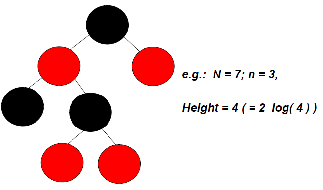
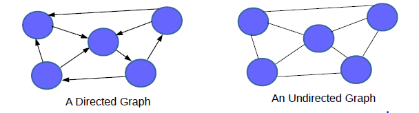
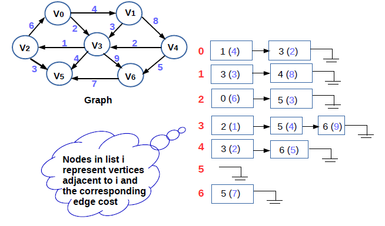

# CSC2001F Preparation <!-- omit in toc -->
## By Angus Mackenzie <!-- omit in toc -->
These are notes I made for an interview I had recently. I thought they might be useful if you want another set of notes.
- [Prep Tips](#prep-tips)
- [Notes](#notes)
    - [Big-O notation](#big-o-notation)
    - [Hashtables](#hashtables)
    - [Trees](#trees)
        - [Binary Search Trees TO DO](#binary-search-trees-to-do)
        - [AVL Trees](#avl-trees)
            - [AVL Tree Rotations](#avl-tree-rotations)
                - [Single Left Rotation (LL Rotation)](#single-left-rotation-ll-rotation)
                - [Single Right Rotation (RR Rotation)](#single-right-rotation-rr-rotation)
                - [Left Right Rotation (LR Rotation)](#left-right-rotation-lr-rotation)
                - [Right Left Rotation (RL Rotation)](#right-left-rotation-rl-rotation)
            - [Search](#search)
            - [Insertion](#insertion)
            - [Deletion](#deletion)
            - [Code for AVLTree:](#code-for-avltree)
        - [B Trees](#b-trees)
            - [Search](#search)
            - [Traverse](#traverse)
            - [Insertion](#insertion)
            - [Deletion](#deletion)
        - [Red Black Trees](#red-black-trees)
            - [Red Black Tree Height](#red-black-tree-height)
            - [Time Complexity](#time-complexity)
            - [Insertion](#insertion)
                - [Leaf Node Colour](#leaf-node-colour)
            - [Insertion](#insertion)
                - [Inserting into Non-Empty Tree](#inserting-into-non-empty-tree)
            - [Fixing the Neighbourhood of a leaf](#fixing-the-neighbourhood-of-a-leaf)
                - [Case 2](#case-2)
        - [Binary Heaps](#binary-heaps)
            - [Insertion](#insertion)
            - [Delete Min](#delete-min)
            - [Heapsort](#heapsort)
    - [Graphs](#graphs)
        - [Representation of Graphs](#representation-of-graphs)
            - [Method 1](#method-1)
            - [Method 2](#method-2)
            - [Example](#example)
        - [Methods for Searching a Graph](#methods-for-searching-a-graph)
            - [Breadth First Search BFS](#breadth-first-search-bfs)
            - [Depth First Search DFS](#depth-first-search-dfs)
        - [Bellman ford](#bellman-ford)
        - [Djikstra's Algorithm](#djikstras-algorithm)
            - [Pseudocode](#pseudocode)
    - [NP-Complete](#np-complete)

# Prep Tips
Algorithm Complexity
* need to know Big-O.
* [Big O CheatSheet](/docs/big-o-cheatsheet.pdf)

Hashtables
* You have to know how they work.
* Should know how to implement one using only arrays in your favourite language, in one interview
* check out my [hashtable](#hashtables) notes

[Trees](#trees)
* construction
* traversal
* manipulation algorithms. 
* Binary trees
* n-ary trees
* [red/black](#red-black-trees) tree, or [AVL](#avl-trees) tree. 
* You should actually know how it's implemented.
* Tree traversal algorithms: BFS or DFS.

Graphs
* Really Important
* three ways to represent a graph in memory 
    * Objects and pointers
    * matrix
    * adjacency list 
* know representation of them with pros and cons
* should know basic graph traversal
    * breadth first search
    * depth first search 
* computational complexity
* tradeoffs and how to implement them in code.
* Know the fancier algorithms like [Dijkstra](#djikstras-algorithm) and A*
* Whenever someone gives you a problem, think graphs.

# Notes
## Big-O notation
Describes the behaviour of a function for big inputs and tries to capture the core of a function. We use it to get a rough estimate of how many seconds various algorithms use for large inputs.
e.g.: Merge sort is O(nlogn) and O(n) in space.
Bubble sort is O(n^2) in time and O(1) in space.
It is the asymptotic performance of an algorithm. How well it performs for extremely large input sizes.
Say we have an array of n elements
```int array[n];```
If we wanted to access the first element of the array this would be O(1) since it doesn't matter how big the array is, it always takes the same constant time to get the first item.

x = array[0];
If we wanted to find a number in the list:
```java
for(int i = 0; i < n; i++){
    if(array[i] == numToFind){ return i; }
}
```
This would be O(n) since at most we would have to look through the entire list to find our number. The Big-O is still O(n) even though we might find our number the first try and run through the loop once because Big-O describes the upper bound for an algorithm (omega is for lower bound and theta is for tight bound).

When we get to nested loops:
```java
for(int i = 0; i < n; i++){
    for(int j = i; j < n; j++){
        array[j] += 2;
    }
}
```
This is O(n^2) since for each pass of the outer loop ( O(n) ) we have to go through the entire list again so the n's multiply leaving us with n squared.

## Hashtables
data structure that implements an associative array abstract data type ina  structure that can map keys to values. Hash table uses a hash function to compute an index into an array of buckets or slots, from which the desired value can be found.
The average space complexity is O(n) for average and worst case and the search time is O(1) while O(n) in worst case
The idea of hashing is to distribute the entries (key/value pairs) across an array of buckets. Given a key, the algorithm computes an index that suggests where the entry can be found:
```
index = f(key, array_size)
```
Often this is done in two steps:
```
hash = hashfunc(key)
index = hash % array_size
```
## Trees
Root - top node
edge is a link between two nodes
child is a node that has a parent
parent is a node that has an edge to a child
leaf is a node that dos not have a child
height is the length of the longest path to a leaf
depth is the length of the path to its root
Binary Tree a tree data structure where each node has at the most two children which are referred to as the left and right child.
Tree Traversal
Depth-First Search (DFS) and Breadth-First Search (BFS)
* DFS is an algorithm that starts at the root first and explores as far as possible along each branch before backtracking
* BFS is an algorithm for traversing or searching tree data structure. It starts at the tree root and explores the neighbor nodes first, before moving to the next level neighbours.
In DFS you can print it out in pre order, in order or post order
Pre order goes to the furthermost left node of a child and prints it and then does the same to the right
In order algorithm prints the left first, the middle second then the right last
Post order is it goes to the left child and prints, gos to to the right child and prints and then prints the node

Binary Search tree - the value at a node is larger then its left child and smaller then its right child
### Binary Search Trees TO DO
### AVL Trees
AVL Tree is a balanced binary search tree. Named after inventors Adelson-Velskii and Landis.
It was the first dynamically balanced trees proposed.   
An AVL tree is a Binary Search Tree which has the following properties.
1. The sub-trees of every node differ in height by at most one.
2. every sub-tree is an AVL tree.
#### AVL Tree Rotations
Insertions rely on adding an extra attribute, the *balance factor*. This tree indicates whether the tree is *left-heavy* (left sub-tree height 1 more than right sub-tree) or *balanced* (sub trees same height) or *right heavy* (the height of the right sub-tree is 1 greater then left)
If the balance would be destroyed by an insertion, a rotation is performed to correct the balance. We need to check the balance factor of every node in the three, if every node satisfies the balance factor condition then we can stop, otherwise we must make it balanced. We use rotations to make the three balanced.

Rotations is the process of moving the nodes to either left or right to make the tree balanced. 
There are four rations, and they are classified into two types:
Single Rotation
* Left Rotation (LL)
* Right Rotation (RR)
Double Rotation
* Left Right Rotation (LR)
* Right Left Rotation (RL)

##### Single Left Rotation (LL Rotation)
Every node moves one position to left from the current position. To understand LL here is an example:


In this example a new item has been added to the right subtree of node 2, causing its height to become 2 greater than 1's left sub-tree. A left rotation is performed to correct the imbalance.

##### Single Right Rotation (RR Rotation)
In RR Rotation every node moves on position to right from the current position. To understand the rotation look at this example:


In this example node 1 is inserted which causes node 3 to have a balance factor of 2 which means that the tree is unbalanced. Rotate the nodes to the right and the tree will be balanced again.

##### Left Right Rotation (LR Rotation)
LR Rotation is a combination of single left rotation followed by single right rotation. In LR rotation, every node moves one position to the left and then one position to the right from their current positions. 


##### Right Left Rotation (RL Rotation)
RL is basically the opposite of LR, effectively: 
RL Rotation is a combination of single right rotation followed by single left rotation. In RL rotation, every node moves one position to the right and then one position to the left from their current positions. 


#### Search
AVL trees have search operations that are performed with O(logn) time complexity. It is done with the following steps:
1. Get Search Element
2. Compare the Search Element with the root node
3. If not matching check whether the search element is smaller or larger than the node value.
4. If smaller continue down left subtree
5. If larger continue down right subtree
6. Repeat until found same element, or hit leaf node.
7. Output result

#### Insertion
Insertion operation is performed with O(logn) time complexity. AVL tree a new node is always inserted as a leaf node. Performed as follows:
1. Insert the new element into the tree using BST logic.
2. After insertion, check Balance Factor of every node
3. If the balance factor is [-1,1] then go to next operation.
4. If the balance factor of the node is greater then the range then rotate to make it balanced
Here is a good example of sequential insertion:


#### Deletion
After deletion we need to check balance factor, if it is balanced then we can go to the next operation. Otherwise we should check balance.

#### Code for AVLTree:
```java
// Java program for insertion in AVL Tree
class Node {
    int key, height;
    Node left, right;
 
    Node(int d) {
        key = d;
        height = 1;
    }
}
 
class AVLTree {
 
    Node root;
 
    // A utility function to get height of the tree
    int height(Node N) {
        if (N == null)
            return 0;
 
        return N.height;
    }
 
    // A utility function to get maximum of two integers
    int max(int a, int b) {
        return (a > b) ? a : b;
    }
 
    // A utility function to right rotate subtree rooted with y
    // See the diagram given above.
    Node rightRotate(Node y) {
        Node x = y.left;
        Node T2 = x.right;
 
        // Perform rotation
        x.right = y;
        y.left = T2;
 
        // Update heights
        y.height = max(height(y.left), height(y.right)) + 1;
        x.height = max(height(x.left), height(x.right)) + 1;
 
        // Return new root
        return x;
    }
 
    // A utility function to left rotate subtree rooted with x
    // See the diagram given above.
    Node leftRotate(Node x) {
        Node y = x.right;
        Node T2 = y.left;
 
        // Perform rotation
        y.left = x;
        x.right = T2;
 
        //  Update heights
        x.height = max(height(x.left), height(x.right)) + 1;
        y.height = max(height(y.left), height(y.right)) + 1;
 
        // Return new root
        return y;
    }
 
    // Get Balance factor of node N
    int getBalance(Node N) {
        if (N == null)
            return 0;
 
        return height(N.left) - height(N.right);
    }
 
    Node insert(Node node, int key) {
 
        /* 1.  Perform the normal BST insertion */
        if (node == null)
            return (new Node(key));
 
        if (key < node.key)
            node.left = insert(node.left, key);
        else if (key > node.key)
            node.right = insert(node.right, key);
        else // Duplicate keys not allowed
            return node;
 
        /* 2. Update height of this ancestor node */
        node.height = 1 + max(height(node.left),
                              height(node.right));
 
        /* 3. Get the balance factor of this ancestor
              node to check whether this node became
              unbalanced */
        int balance = getBalance(node);
 
        // If this node becomes unbalanced, then there
        // are 4 cases Left Left Case
        if (balance > 1 && key < node.left.key)
            return rightRotate(node);
 
        // Right Right Case
        if (balance < -1 && key > node.right.key)
            return leftRotate(node);
 
        // Left Right Case
        if (balance > 1 && key > node.left.key) {
            node.left = leftRotate(node.left);
            return rightRotate(node);
        }
 
        // Right Left Case
        if (balance < -1 && key < node.right.key) {
            node.right = rightRotate(node.right);
            return leftRotate(node);
        }
 
        /* return the (unchanged) node pointer */
        return node;
    }
 
    // A utility function to print preorder traversal
    // of the tree.
    // The function also prints height of every node
    void preOrder(Node node) {
        if (node != null) {
            System.out.print(node.key + " ");
            preOrder(node.left);
            preOrder(node.right);
        }
    }
 
    public static void main(String[] args) {
        AVLTree tree = new AVLTree();
 
        /* Constructing tree given in the above figure */
        tree.root = tree.insert(tree.root, 10);
        tree.root = tree.insert(tree.root, 20);
        tree.root = tree.insert(tree.root, 30);
        tree.root = tree.insert(tree.root, 40);
        tree.root = tree.insert(tree.root, 50);
        tree.root = tree.insert(tree.root, 25);
 
        /* The constructed AVL Tree would be
             30
            /  \
          20   40
         /  \     \
        10  25    50
        */
        System.out.println("Preorder traversal" +
                        " of constructed tree is : ");
        tree.preOrder(tree.root);
    }
}
// This code has been contributed by Mayank Jaiswal to Geeksforgeeks
```
Output is:
```
Preorder traversal of the constructed AVL tree is
30 20 10 25 40 50
```
### B Trees
Self balancing tree data structure that keeps data sorted and allows searches, sequential access, insertions, and deletions in logarithmic time. It is a generalization of BST in that a node can have more than two children. The use of B trees is more suited to large amounts of data that cannot fit into main memory. Height of B-trees is kept low by putting max possible keys in a B-tree node.

Properties of B-Tree:
1. All leaves are at same level
2. A B-ree is defined by the term *minimum degree* 't'. The value of t depends on the block size.
3. Every node except root must contain at least t-1 keys. Root may contain minimum 1 key.
4. All nodes (include root) may contain at most 2t - 1 keys. 
5. Number of children of a node is equal to the number of keys in it plus 1.
6. All keys of a node are sorted in increasing order. The child between two keys k1 and k2 contains all keys in range from k1 and k2.
7. B-Tree grows and shrinks from root, which is unlike BST. BST grow downward and also shrink downward.
8. Like other balanced BST, time complexity to search, insert and delete is O(logn);


This example is smaller than a typical B tree.

#### Search
Similar to BST search, let the key be searched  b K. We start from root and recursively traverse down. For every visited non-leaf node, if the node has key, we simply return the node. Otherwise recuse down to the appropriate child of the node. If we reach a leaf node and dont find k then we return null;

#### Traverse
Traversal is similar to an inorder traversal of Binary Tree. We start from the leftmost child, recursively print the leftmost child, then repeat the same process for remaining children and keys. In the end, recursively print the rightmost child.

#### Insertion
A new key is always inserted at leaf node. Let the key to be inserted be K, like BST we start from the root and traverse down till we reach a leaf node. Once we reach a leaf node, we insert the key in that lead node.

But before inserting a key to a node, we make sure that the node has space available for key before the key is inserted. We use an operation called splitChild(). It is used to split a child of a node. Look at this diagram for further info.


If the node is full we split it effectively.
Thus the algorithm for insertion is:
1. Initialize x as root
2. While x is not a leaf:
    1. Find the child of x that is going to be traversed next. Let the child be y
    2. If y is not full, change x to point to y
    3. If y is full, split it and change x to point to one of the two parts of y. If k is smaller than mid key in y, then set x as first part of y. Else second part of y. When we split y, we move a key from y to its parents.
3. Loop in step 2 when x is leaf. X must have space for 1 extra key as we have been splitting all nodes in advance. So simply insert k to x.

In order to understand the algorithm here is an example with *minimum degree * t as 3 and a sequence of numbers [10,20,30,40,50,60,70,80,90] inserted into an empty B-tree

Initially the root is NULL so insert 10


Let us insert 20, 30, 40, 50. They will be insert in root because max number a node can have is 2*t-1 which, in this case is 5.


Now we want to insert 60, but the root node is full. So we must split into two, then 60 will be inserted into the appropriate child.


Let us now insert 70 and 80. These keys will be inserted into the appropriate leaf without a split.


Now we can insert 90. This wil also cause a split, the middle key will go up to the parent.


#### Deletion
B-Tree is a multi-way search tree. Deletion from a B-tree is more complicated than insertion. This is because we can delete a key from any node- not just a leaf - and when we delete a key from an internal node we will have to rearrange the node's children.

The deletion procedure deletes the key k from the subtree rooted at X. This procedure guarantees that whenever it calls itself recursively on a node x, the number of keys in x is at least the minimum degree t. This condition required one more key than the minimum required by the usual B-tree conditions, so that sometimes a key may have to be moved into a child node before recursion descends to that child.

1. If the key k is in node x and x is a leaf, delete the key k from x.
2. If the key k is a node x and x is an internal node, do the following:
    1. If the child y that precedes k in the node x has at least t keys, then find the predecessor k0 of k in the sub-tree rooted at y. Recursively delete k0, and replace k by k0 in x. (we can find k0and delete it in a single downward pass)
    2. If y has fewer than t keys, then, symmetrically, examine the child z that follows k in node x. If z has at least t keys, then find the successor k0 of k in the subtree rooted at z. Recursively delete k0, and replace k by k0 in x. (We can find k0 and delete it in a single downward pass)
    3. Otherwise, if both y and z have only 
    continue here: https://www.geeksforgeeks.org/b-tree-set-3delete/
### Red Black Trees
Self balancing binary search tree in CS. Each node of the BT has an extra bit that represents colour. Red or black. These colour bits ensure that the tree remains approximately balanced during insertions and deletions.
Created by Guibas and Sedgewick in 1978
They are high performance BSTs that guarantee O(log2n) time for insert and delete operations
Gold standard for balanced search trees, used in Java Collections Framework and C++ STL
Minimizes computation overhead for insert and delete

Properties
1. Every node is either red or black
2. The root of the tree is always black
3. If a node is red:
    All its children must be black (cannot have 2 consecutive red nodes on any path from root down to node X)
4. For every node X, every path from X to a null reference (i.e. an empty left or right child) must contain the same number of black nodes.
5. External nodes (nulls) are black.

Implications of Red Black Tree Rules
* If a red node has any child nodes, it must have 2 children and they must be black nodes
* if a black node has one child note that child must be a red leaf node
* Due to these rules there are limits on how unbalanced a red black tree can become.

As a result of the red block properties
* Red black trees are approximately balanced
* insertion and deletions are a constant O(logN) worst case
* insert and delete operations are faster by a constant factor compared to AVL trees
* Average node height: comparable to AVL trees O(logN) so find operations just as fast.

Maintaining these properties, a red black tree with n internal nodes ensures
* Its height is at most #2log(n+1)#. Thus, a red black tree may be unbalanced
* But will avoid becoming a linked-list that is longer than 2log(n+1)+1

What do max and min height red-black trees look like? Here is a simple example:


* If a red black tree is complete, with all black nodes except for red leaves at the lowest level, height will be **minimal**.
Minmum height, for read-black tree with n internal nodes, N nodes total is log(4)



* To get the max height for n internal nodes, there should be as many red nodes as possible down one path and all other nodes are black.
* Max height for red-black tree with n internal nodes and N nodes total will be $2log(n+1)=2log(4)$ for the above case

Here is another example of the maximum height of a RB tree:


In this case the $Max height = 2log(n+1)$ where n is the amount of internal nodes:
[12, 14, 35, 21, 56, 99, 80] are the internal nodes. Thus the max height will be 
$$2log(8)=6$$
What will the search time be?
The search time for RB trees is $Olog(n)$ where n is the height of the tree. So thus the search time for this tree will be:
$$Olog(6)≈2.58$$

#### Red Black Tree Height
Max height is always 2log<sub>2</sub>n
* Start with RB tree with N nodes and n internal nodes.
    * N = 10
    * n = 5
* Remove all the red nodes, moving children of red node up to be children of its parent

The result will be a tree containing at most N nodes.
* All internal nodes have 2 children
* All leaves at the same level

e.g.:


Here N = 10 and n = 5. Thus the Max Height is 5 because
$$2log_2(n+1)=2log_2(6) ≈ 5$$

Here is an example of a min RB tree:


After red node removal we have a 4-ary tree that is balanced, since:
* For every node X, every path from X to an empty left or right child must contain the same number of black nodes.

Adding back the red nodes can increase the height by at most a factor 2, since:
* If a node is red, all its children must be black (cannot have 2 consecutive red nodes on any path from root down to any node)


No path from node x to a leaf node is more than twice as long as any other path from node x to a leaf.

Let bh(x) = lack height of node x

Then the length of a longest path from x to a leaf: = 2bh(x) 
Path where red and black nodes alternate

Length of the shortest possible path from x to a leaf = bh(x) (path that only contains black node)


Here N = 14, n = 7, Height = 5
* Max Height = 2(log<sub>2</sub>8) = 6
* Min height = log<sub>2</sub>8 = 3

#### Time Complexity
All non-modifying BST operations (min, max, successor, predecessor, find) run in $O(log_2N)$ to $O(h$)
* The red black colour flag allows minimal storage per node.

Insert and delete must maintain rules of red black trees and therefore more complex, but still:
$O(log_2N)$

#### Insertion
* Insert in red-black trees is top down
* ALl operations done while descending the tree from root down to where the new node will be inserted
* Permits an efficient, iterative implementation of insert.
* Red-black insert uses tri-node restructuring + "colour-change" operations
* Ensures the red-black properties are invariant
* AVL descends from root and then finds a place to insert the new node, detecting failures of the AVL property is done on the way back to the root. THis means that the travelling to the root leaf is done twice.
##### Leaf Node Colour
A new red-black tree node will be initially inserted as a leaf node, using the usual BST insert algorithm. But what should the colour of the new leaf node be.
* If its a root node then it must be a black node
* What if it is a non-root leaf node

Then it must be red

#### Insertion
Insert key K into tree T.
If T is an empty tree then replace it with a single black node containing K. This ensures that the root property is satisfied.

If T is a non-empty tree, then
* Use the BST insert algorithm to add K to the tree
* Colour the node containing K as red
* Restore red-black tree properties

##### Inserting into Non-Empty Tree
What we need to do to maintain red-black tree properties depends on the colours of K's parents.

Let P be K's parents. There are two cases
* Case 1: P is a black node
    * If k's parent P is black then the addition of K did not result in the red-property being violated.
    
* Case 2: P is red node
    * If K's parent P is red, P now has a red child violating the red property
    * P's parent, G must be black because of the previous rules of RB trees
    
    * To handle this double-red situation, must consider the colour of G's other child. P's sibling S, but that *might* be null.
    * To show this solution we will work through an example

Example:

 

In this example, the X node is initially coloured red. The parent of X is P, which is also red. The sibling of P is d which is d is black. The parent of d and P is G, which must be black.

This can be fixed with one tri-node operation for P, G, X and flipping P, G node colours.


X is still red, but its parent is now black. G is now red, but its parent is black (thats good)
Children of now red node G : d and former right child of P, e.i. C

Going to work through som examples to get a better understanding of this section:

Insert 3


1 Rotation and re colouring result:


#### Fixing the Neighbourhood of a leaf
* Case 1: P is left child of G, and X is left child of P (X is "outside of grand-child" of G) - example shown
* Case 2: P is left child of G, and X is right child of P (X is "inside grand-child" of G)
* Case 3: P is right child of G, and X is left child of P (X is "inside grand-child" of G)
* Case 4: P is right child of G, and X is right child of P (X is "outside grandchild" of G)

##### Case 2
Insertion of X can be fixed with 2 rotations between X, P and G, and re-colouring of X and G


Before the rotations and restructuring X was red, its parent P was also red <-problem
P was red, parent G must have been black
d was black

After the rotations X is black, G is red but its parent is black children of G are d and former child of X which must be black, since X was formerly red.

Another Case 2 Example:


Solution


However, there is a problem with this method. It is assumed that S the sibling of P is black. If S is read these operations may not restore all red-black invariants. Descend the tree looking for a place to insert the new ode, make changes if we find a node that has 2 red children.

Must do this as when at place where we are inserting new red leaf node X, we can be sure that the grandparent of X does not have 2 red children.

**Algorithm** for red black insertion
* Descend the tree from root - at each node X:
    * If X has 2 red children (X must be black) THEN:
        * Change X to red, and its children to black
    * If X is root THEN re-colour it back to black
    * If X's parent is black, THEN, continue
    * Else consider X, parent P, grandparent G as ene of case 1-4
        * Tri-node restructure / re-colouring
    * Continue descending from X
    * When at null where new node (X) will be inserted:
        * Create a new red node and insert it there
        * Apply case 1-4 to the new node as needed
            * Do tri-node restructure / recolouring.

The algorithm will ensure that when inserting into a tree, the red black properties are met

Here are further examples of this algorithm in action:

Insert 45 into the following RB tree:

Here the issue is that 50 has 2 red children. So we need to change that Change 50 to red, and its children to black. Now 50 is red, and has a red parent. Apply case 1


So we do a tri node operation and re-colour.


Then key 45 is inserted to the right child of 40, and it is fine because the leaf's parent is black so there is nothing more to do.


There are some more examples [here](docs/RedBlackTrees.pdf).
### Binary Heaps
A binary heap is a complete binary tree which satisfies the heap ordering property. The ordering can be one of two typesL 
* The min-heap property the value of each node is greater than or equal to the value of its parent, with the minimum value element at the root
* The max-heap-property: the value of each node is less than or equal to the value of its parent, with the maximum value element at the root.

A heap is not a sorted structure and cab be regarded as partially ordered. A heap with N nodes always has O(logN) height. A commmon use of heap is to implement a priority queue.

#### Insertion
When a new element is added it is appended to the end of the heap. The heap property is repaired by percolating the element up to where it is supposed to be


Here is code to describe the f0llowing:
```java
public void insert(Comparable x)
{
	if(size == heap.length - 1) doubleSize();

	//Insert a new item to the end of the array
	int pos = ++size;

	//Percolate up
	for(; pos > 1 && x.compareTo(heap[pos/2]) < 0; pos = pos/2 )
		heap[pos] = heap[pos/2];

	heap[pos] = x;
}
```

Insertion time is O(logn)
#### Delete Min
The minimum element can be found at the foot, which is the first element of the array. We remove the root and replace it with the last element of the heap and then restore the heap property percolating down.
Deletion time is O(logn)

#### Heapsort
This algorithm runs in two steps, given an array of data we build a heap and then turn it into a sorted list by calling delete in. The runtime of the algorithm is O(nlogn)

## Graphs
Is a pictorial representation of a set of objects where some pairs of objects are connected by links. The interconnected objects are represented by points, termed as vertices, and the links that connect the vertices are called edges.

Hence, G=(V,E) where V is the set of vertices and E the set of edges.

Each edge is a pair (v,w) where v, w are elements of E.

Vertices are called nodes sometimes, and edges can be called args. A directed graph is one in which the edge pair is ordered u->v =>(u,v)

An undirected graph, the order of the vertices in the paris does not matter.
There are different types of graphs:
* Edge-weighted undirected graph
* Ege-weighted directed graph
* Unweighted undirected graph
* Unweighted directed graph

A directed graph is one which the edge pair is ordered.

An undirected graph, an edge (v,w) will imply (w,v)


- Vertex w is adjacent to vertex v if there is an edge from v to w.
- An edge cost (weight) measures the cost of traversing the edge
- A path is sequence of vertices connected by edges.
- An unweighted path length is the number of edges on a path
- A weighted path is the sum of the cost of the edges of the path
- A simple path is a pth in which all the vertices are distinct, except that th first and last vertices can be the same.
- A path may exist from a vertex to itself: path length is 0 if the path contains no edges
- Cycle in a directed graph is a path that begins and ends at the same vertex and contains at least one edge
- A cycle is simple if the path is simple
- A cyclic graph is a directed graph with at least one cycle.
- A directed acyclic graph is a kind of directed graph having no cycles
    - A dense graph is one in which the number of edges is quadratic with respect to the number of vertices.
    $$|E| = O|V^2| $$
    - A sparse graph is one in which the number of edges is typically linear with respect to the number of vertices
    $$|E| = O|V $$

### Representation of Graphs
#### Method 1
- Assume the vertices are numbered sequentially (V0,V1,V2)
- Use a two dimensional array to represent the matrix
- Also known as an "Adjacency Matrix" Or connection matrix
    - Of size VxV where V is the number of vertices in the graph
    - ```Adj[u][v] = 1``` indicates that there is an edge from vertex u to vertex v in the graph
    - ```Adj[u][v] = w``` indicates that there is an edge from vertex u to vertex v with weight w
- Adjacency Matrix for undirected graph is always symmetric i.e. edge(u,v) implies the edge(v,u);
- Nonexistant edges can be initialised to infinity or 0


* Simple and easy to follow, easy to work with.
* However:
    * Initialisation cost $O(|V^2|)$
    * Space cost is also $O(|V^2|)$ -> Even if Graph is sparse
    * Need to know the edges adjacent to the current verte, $O(|V|)$
    * Huge effort for adding or removing a vertex
    * V is the number of vertices
* They are the method of choice for representing **dense graphs**
* Not a good choice for **sparse graphs** (superflous)
 * Initialisation cost $O(|V^2|)$
 * Space cost $O(|V^2|)$

#### Method 2
An adjacency linked list is a better choice for representing sparse graphs
* Uses an array of linked lists (arraySize = V)
* array be A[i]
* A[i] represents the linked list of vertices adjacent to the ith vertex



* Adjacency list better choice for sparse graphs due to compact representation
* Space cost is linear $O(|E|)$
* Get list of adjacent vertices in O(1)
* Adding a new vertex can be done in O(V), but removal results in O(E) complexity
* Most algorithms assume graphs are represented as adjacency lists

#### Example
Here is an exercise to show the visual representation of data, with the adjacency list and graph.

The initial values:


Here is the adjacency matrix


Here is the adjacency list


### Methods for Searching a Graph
Algorithms for traversing a graph; two methods that are really prevalent.
#### Breadth First Search BFS
Uses a queue mechanism and well suited for shortest path problems

Given a graph G(V,E) and a distinguished source vertex s, BFS systematically explores the edges of G to discover every vertex that is reachable from S.
So it computes the distance from s to every reachable vertex.

A breadth first tree is produced with root s that contains all reachable vertices.
It achieves $O(|V| + |E|)$

To keep track of progress, the BFS colours each vertex grey, white or black. All vertices start out white and may later become grey and then black. If a vertex is discovered the first time it becomes gray. If (v,w) in E and vertex V is black, then W is either black or gray. 

A vertex is discovered only once so it has at most 1 parent.
```python
BFS(s, Adj):
    level = {s: 0} //initialisation of source node
    parent = {s: none} // initialisation for s as root node
    i = 1
    frontier = [s] // level i-1
    While frontier:
        next = [ ] // level i
        for u in frontier:
            for v in Adj[u] : // adjacent vertices
                if v not in level // not already traversed
                    level[v] = i
                    parent[v] = u //keeping track of the parent node
                    next.append(v) // discovered vertices
            frontier = next // next vertex to traverse
        i += 1 // increment i
```

Illustration of this:


BFS guarantees shortest path discovery in a connected graph. If a node is not reachable when a BFS algorithm is run, then it returns infinity.
The shortest path distance (unweighted path length) from S to V is the minimum number of edges in any path from S to V.
Shortest path aglorithms are single source algorithms that computer the shortest paths from starting point to all vertices


Full walkthroughs of the above examples are [here](docs/BFS.pdf)
#### Depth First Search DFS
Uses a stack mechanism and not very well suited for shortest path problems
```java
// Java program to print DFS traversal from a given given graph
import java.io.*;
import java.util.*;
 
// This class represents a directed graph using adjacency list
// representation
class Graph
{
    private int V;   // No. of vertices
 
    // Array  of lists for Adjacency List Representation
    private LinkedList<Integer> adj[];
 
    // Constructor
    Graph(int v)
    {
        V = v;
        adj = new LinkedList[v];
        for (int i=0; i<v; ++i)
            adj[i] = new LinkedList();
    }
 
    //Function to add an edge into the graph
    void addEdge(int v, int w)
    {
        adj[v].add(w);  // Add w to v's list.
    }
 
    // A function used by DFS
    void DFSUtil(int v,boolean visited[])
    {
        // Mark the current node as visited and print it
        visited[v] = true;
        System.out.print(v+" ");
 
        // Recur for all the vertices adjacent to this vertex
        Iterator<Integer> i = adj[v].listIterator();
        while (i.hasNext())
        {
            int n = i.next();
            if (!visited[n])
                DFSUtil(n, visited);
        }
    }
 
    // The function to do DFS traversal. It uses recursive DFSUtil()
    void DFS(int v)
    {
        // Mark all the vertices as not visited(set as
        // false by default in java)
        boolean visited[] = new boolean[V];
 
        // Call the recursive helper function to print DFS traversal
        DFSUtil(v, visited);
    }
 
    public static void main(String args[])
    {
        Graph g = new Graph(4);
 
        g.addEdge(0, 1);
        g.addEdge(0, 2);
        g.addEdge(1, 2);
        g.addEdge(2, 0);
        g.addEdge(2, 3);
        g.addEdge(3, 3);
 
        System.out.println("Following is Depth First Traversal "+
                           "(starting from vertex 2)");
 
        g.DFS(2);
    }
}
```
### Bellman ford
This is an algorithm that computes the shortest path from a single source vertex to all of teh other vertices in a weighted graph. It is slower than Djikstra's algorithm for the same problem but is more versatile because it can handle negative edges

Belmman ford runs in O(|V|*|E|) time
```python
 function BellmanFord(list vertices, list edges, vertex source)
   ::distance[],predecessor[]
   
   // This implementation takes in a graph, represented as
   // lists of vertices and edges, and fills two arrays
   // (distance and predecessor) with shortest-path
   // (less cost/distance/metric) information
   
   // Step 1: initialize graph
   for each vertex v in vertices:
       distance[v] := inf             // At the beginning , all vertices have a weight of infinity
       predecessor[v] := null         // And a null predecessor
   
   distance[source] := 0              // The weight is zero at the source
   
   // Step 2: relax edges repeatedly
   for i from 1 to size(vertices)-1:
       for each edge (u, v) with weight w in edges:
           if distance[u] + w < distance[v]:
               distance[v] := distance[u] + w
               predecessor[v] := u
   
   // Step 3: check for negative-weight cycles
   for each edge (u, v) with weight w in edges:
       if distance[u] + w < distance[v]:
           error "Graph contains a negative-weight cycle"
   
   return distance[], predecessor[]
```
### Djikstra's Algorithm
Is used to solve the positive weighted Shortest Path Problem
* A graph ust be connected (a path between every pair of vertices)
* All edges must have non-negative weights
* Directed or undirected graph
#### Pseudocode
```
dist[source]==0 //distance to the source vertex is 0
for(v in V-source){ //for the remaining vertices
    dist[v]=∞; //set all distances to infinity
}
Visited = 0; //set visited vertices set to zero
q = V; // the queue is set to all vertices
while(q!=0){ //while there are vertices
 currentVertex = min(q.dist); //select the element of q with the smallest distance
 visited + currentVertex; //add the current vertex to list of visited ones
 for(v in neighbours[currentVertex]){  // go through neighborus of current vertex
     if(v.dist > currentVertex.dist+w(u,v)){ //if a new shortest path is found
        d[v]=d[currentVertex]+w(u,v) //set new shortest path
     }
 } 
}
```
## NP-Complete
An NP complete decision problem is one belonging to both the NP and the NP-hard complexity classes. In this context, NP stands for nondeterministic polynomial time. The set of NP-complete problems is often denoted by NP-C or NPC.
The most notable characteristic of NP-complete problems is that no fast solution to them is known. They require time to solve the problems using any currently known algorithm increases very quickly as the size3 of the problem grows.